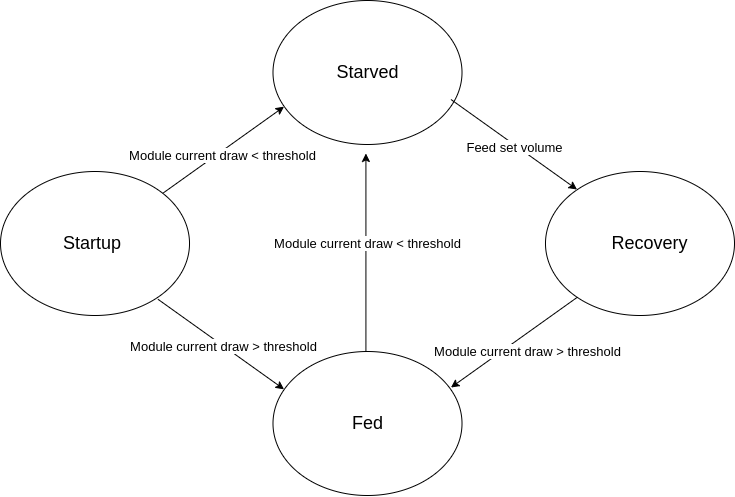

# FSM-Based Microbial Electrolysis Cell (MEC) and Anaerobic Digestion (AD) Control System

The control system introduced in this repository is designed to optimize the anaerobic digestion process by automating the control of feeding intervals based on the microbial activity in the reactor. By monitoring the current draw, which correlates with the bacterial metabolic rate, the FSM facilitates real-time adjustments to feeding based on changes in organic load. The Digital-to-Analog Converter (DAC) controls the pump, and relay code manages the timing to turn off mixing before feeding to prevent feed washout.

## Project Overview
The control system introduced in this repository is designed to optimize the anaerobic digestion process by automating the control of feeding intervals based on the microbial activity in the reactor. By monitoring the current draw, which correlates with the bacterial metabolic rate, the FSM facilitates real-time adjustments to feeding based on changes in organic load.

### Highlights
- **Automated Feeding Control**: Implements a FSM for real-time, automated feeding control in MEC-AD systems.
- **Real-time System Feedback**: Utilizes current draw as a direct indicator of microbial activity for dynamic feeding adjustments.
- **Scalability and Reduced Oversight**: Successfully tested in lab-scale reactors with potential scalability for industrial applications.

## Repository Contents
- `src/` - Contains all source code files for micro controller firmware
- `reactor_controll/main.py` - Primary operation script

## System Requirements
- Python 3.x
- Adafruit Libraries for hardware control

Thanks to all collaborators and advisors who have contributed to the project.
University of Bristol 
University of Westminster 
WASE 

